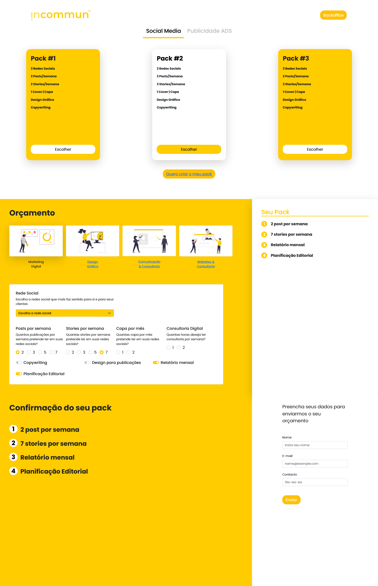

# Project for the curricular unit "Projeto Integrado 3"

  
  
  
   
  

 <a href="#about">About</a> •
 <a href="#layout">Layout</a> • 
 <a href="#tech">Tech</a> • 
 <a href="#author">Author</a> • 

<h1 align="center">
    
</h1>

## 💻 About

Project developed for my university course and a enterprise.

The Curricular Unit (CU) of "Projeto Integrado 3" has as main objectives to relate the different contents of the CUs of the
semester, facilitating the construction of knowledge with the integration of different disciplinary knowledge, in a strategy
interdisciplinary.

This project aims to allow the client to make a budget, for one of the 4 categories, after that in the backoffice, the company has many resources, one of them is a tool to see how much is the budget of each client. 

---

## 🎨 Layout

The layout was created by all authors involved.

---

## 🛠️ Tech

The following tools were used in the construction of the project:

- **[Html](https://developer.mozilla.org/en-US/docs/Glossary/HTML)**
- **[Bootstrap](https://getbootstrap.com/)**
- **[React](https://reactjs.org/)**
- **[Node](https://nodejs.org/en/)**
- **[Express](https://expressjs.com/)**

---

## 🧑🏻 Author

,
, David Almeida, Pedro Furtado,, Francisco Ferrand
